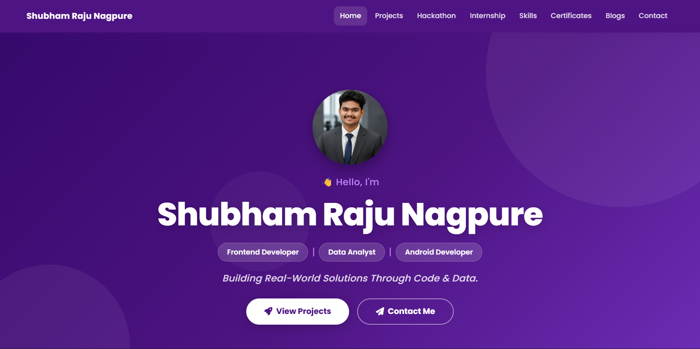

<div align="center">

# 🚀 Shubham Raju Nagpure | Developer Portfolio

**Frontend Developer | Android Developer | Data Analytics Learner | Python/AI Builder**

[](https://shubham-nagpure.netlify.app)
[](https://www.linkedin.com/in/shubham-nagpure-901283226)
[](mailto:nagpureshubham303@gmail.com)

</div>



## 📌 About This Portfolio
Welcome to the source code of my personal developer portfolio! This fully responsive, modern web application serves as a dynamic resume, showcasing my technical skills, hands-on projects, hackathon experiences, and verified certifications. It’s designed clean and recruiter-friendly, reflecting my passion for creating real-world solutions through code and data.

## 🙋‍♂️ About Me
I am a **B.Sc. IT Student** driven by the enthusiasm to build scalable applications and derive actionable insights from data. I specialize in crafting engaging frontend web interfaces, robust Android applications, dynamic AI tools, and insightful data dashboards. 

My approach to software engineering and data analytics focuses on identifying problems and building well-engineered, user-centric solutions. Under pressure, I deliver—as proven by my active participation in intense hackathons and successful internships.

## ✨ Features
- **Responsive Design:** Seamless experience across mobile, tablet, and desktop devices.
- **Modern UI/UX:** Clean aesthetics, glassmorphism elements, CSS animations, and smooth scrolling.
- **Dynamic Projects Showcase:** Filterable grids categorized perfectly by tech stack and domain.
- **Hackathon & Internship Highlights:** Documented real-world experiences alongside certifications.

## 💻 Highlighted Projects

### 🛡️ 1. RapidAid – Smart Emergency Response App
A robust Android application designed to reduce emergency response time through an intuitive interface.
- **Features:** One-tap SOS, automated SMS alerts with live location sharing, emergency call triggers.
- **Tech Stack:** Kotlin, Android Studio, Firebase (Auth + Real-time DB), Google Maps API.

### 🧠 2. Dev Profile Analyzer
An AI-powered tool that evaluates a developer's GitHub profile from a recruiter's perspective.
- **Features:** Portfolio score engine (0–100), repository depth analysis, visual language distribution, and actionable recruiter-style insights.
- **Tech Stack:** Python, Streamlit, GitHub REST API, Matplotlib.

### 🛒 3. Hyperlocal Secondhand Market
A direct buyer-to-seller marketplace platform designed to eliminate the middleman in local neighborhoods.
- **Features:** Direct product listings, seamless buyer-seller connection, responsive UI, real-time database management.
- **Tech Stack:** HTML, CSS, JavaScript, PHP, MySQL, Firebase.

### 📊 4. Power BI Data Dashboard
An enterprise-grade Business Intelligence dashboard transforming raw data into actionable insights.
- **Features:** Interactive drill-down charts, KPI tracking, and advanced data modeling calculations.
- **Tech Stack:** Power BI, Excel, DAX, Data Modeling.

### 🚀 5. Karo Pitch – Startup Landing Page
A modern, visually stunning landing page for startup founders to pitch ideas to investors.
- **Features:** Fully responsive UI, clean aesthetics, focused on converting opportunities to investments.
- **Tech Stack:** HTML, CSS, JavaScript.
- **Live Demo:** [Karo Pitch Demo](https://shubham-coder-a.github.io/karo-pitch-landing-page/)

## 💼 Internships

**1. Data Analytics Intern | *Codveda Technologies***
- Conducted extensive data cleaning and pre-processing tasks.
- Performed detailed Exploratory Data Analysis (EDA) to uncover trends.
- Built and tested a Logistic Regression model achieving **93% accuracy**.

**2. App Development Intern | *CodeAlpha***
- Engineered a complete Flashcard Quiz Application as a primary deliverable.
- Implemented `localStorage` for offline data persistence.
- Successfully deployed the project on GitHub for public access.

## 🏆 Hackathon Experience
**Offline Participant | *CodeLite Hackathon 2026***
- Designed, built, and presented **RapidAid** under intense time constraints.
- Showcased the ability to build functional, high-impact products from scratch in real-time.

## 🛠️ Technical Skills

| Domain         | Technologies & Tools |
|----------------|----------------------|
| **Frontend**   | HTML, CSS, Bootstrap, JavaScript |
| **Android**    | Kotlin, Android Studio, Firebase |
| **Data**       | Power BI, Excel, SQL, Data Visualization |
| **Programming**| Java, Python, C |
| **Tools**      | Git, GitHub, REST APIs |

## 🚀 Future Goals
As I continue my journey in tech, I aim to:
- Deepen my expertise in **Full-Stack Development** and scalable backend architectures.
- Integrate advanced **Machine Learning** models directly into mobile and web platforms.
- Contribute extensively to **Open Source** projects and collaborative engineering teams.

## ⚙️ How to Run Locally

If you wish to explore the code locally on your machine, follow these steps:

1. **Clone the repository:**
   ```bash
   git clone https://github.com/shubham-coder-a/shubham-portfolio.git
   ```
2. **Navigate to the project directory:**
   ```bash
   cd shubham-portfolio
   ```
3. **Open the project:**
   Simply open the `index.html` file in your preferred web browser, or use an extension like **Live Server** in VS Code for a better development experience.

## 📫 Contact

Feel free to reach out if you want to discuss technology, collaborate on a project, or just say hello!

- **Email:** [nagpureshubham303@gmail.com](mailto:nagpureshubham303@gmail.com)
- **LinkedIn:** [Shubham Nagpure](https://www.linkedin.com/in/shubham-nagpure-901283226)
- **Portfolio:** [shubham-nagpure.netlify.app](https://shubham-nagpure.netlify.app)
- **GitHub:** [shubham-coder-a](https://github.com/shubham-coder-a)

---
<div align="center">
  <sub>Built with ❤️ by Shubham Raju Nagpure</sub>
</div>